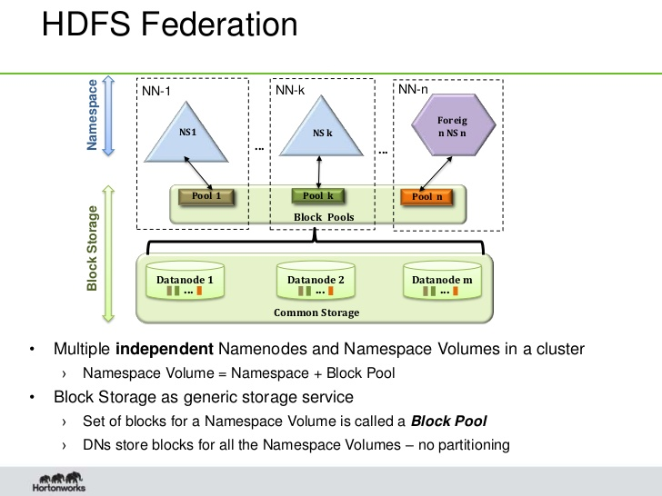

### 主要特点

廉价机器组成集群，系统具备容错能力
> HDFS 集群中数据节点可能随时宕机，主节点能通过心跳及时发现故障，并启动文件块恢复。主节点对内存要求高，因为元数据信息要保存在内存中。

适合批量分块、一次写多次读
> 不像POSIX文件系统，常常流式从头读到尾，随机修改内容等，HDFS文件只支持追加到末尾。单次读取延时高，但批量任务可以通过多个block分块并发读取提高吞吐量。

将运算移到数据的附近，而不是相反
> HDFS数据节点往往承担计算任务，调度器会就近分配计算任务。比如MapReduce任务，每个Map任务最好在分片本地进行。但Reduce还是免不了要移动中间数据到计算节点。

### HDFS 架构图

### Namenode

Namenode保存元数据信息，具体回答两个问题：
> * filename->block sequence (namespace) 文件由哪些block组成
* block->machinelist ("inodes") 这些block保存在哪些机器上

> namespace信息就是一颗文件树，所有数据放到内存中，接受各种增删改查的请求； inodes 信息可能由于故障恢复、Balance等操作发生变化

#### Namenode的启动过程

1. 读取fsimage并构造内存版本的元数据信息
2. 读取editlog，并应用可能的元数据修改
3. 写新的 checkpoint (fsimage' + editlog)
4. 维持在安全模式下（可读，拒绝增删改），直到收到足够多的、来自Datanode的block报告

启动过程可能存在的问题：
1. editlog太多，导致合并花费时间很长；于是社区开发了 secondary-namenode 来定期合并editlog，生成新的fsimage。社区有另外一种叫法： checkpoint-namenode。这不是一个高可用（HA）方案。

2. fsimage太大，内存装不下。hdfs federation分卷可以解决这个问题。

#### Namenode 高可用方案

这个方案的核心：
1. 依赖共享存储来同步写操作。一般认为高端存储的可靠性要高于服务器。但这个也是单点。
2. DN同时向Active和Standby NN汇报块状态
3. 依赖Zeekeeper来实现主备切换。FailoverController是单独的进程，监控NN状态
4. 防[脑裂](http://en.wikipedia.org/wiki/Split-brain_`(computing`))措施：共享存储只支持来自一个NN的更新操作；DN只执行来自一个NN的更新命令；Client只同时跟一个NN通信

#### Hdfs federation

这个方案的核心：
1. 就像Linux文件系统一样，多个NN可以挂在不同的子目录下，各自负责该子目录下的元数据管理；彼此独立。
2. 多个NN共享DN的块存储。DN可向多个NN汇报块状态

### HDFS文件读过程

### HDFS文件写过程

### 参考
[Hadoop源代码](http://github.com/apache/hadoop)

[understanding-namenode-startup-operations-in-hdfs](http://zh.hortonworks.com/blog/understanding-namenode-startup-operations-in-hdfs/)

[namenode ha & federation](http://www.infoq.com/cn/articles/hadoop-2-0-namenode-ha-federation-practice-zh)
